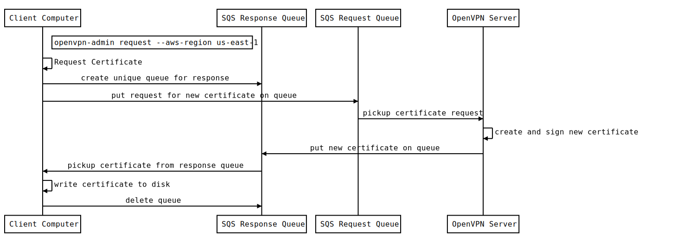

# openvpn-admin

This module contains a command-line utility that allows users to request new certificates, administrators to revoke 
certificates and the OpenVPN server to process those requests.

## How do you use this module?

#### Examples

1. Build the binaries for this module or download the relevant release binary (for your desired distro) on your client 
machine from [the releases page](https://github.com/gruntwork-io/package-openvpn/releases).
2. Run the command you need on your client machine
```
$ openvpn-admin request --aws-region us-east-1
$ openvpn-admin revoke --aws-region us-east-1 --username john.doe
$ openvpn-admin process-requests --aws-region us-east-1
$ openvpn-admin process-revokes --aws-region us-east-1
```
_**N.B.:** If the above doesn't work, check if you're running the binary from it's directory, and if it's called `openvpn-admin` or something else._

_**N.B.:**_ You'll need to have your `AWS_ACCESS_KEY_ID` and `AWS_SECRET_ACCESS_KEY` env variables set for aws auth to work with `openvpn-admin`. 
You can also use `aws-vault` or if you’re on AWS, it will use the IAM role of the instance._

#### Install openvpn-admin on your servers

`openvpn-admin` consists of a single binary. The easiest way to get it onto your servers is to use the [Gruntwork
Installer](https://github.com/gruntwork-io/gruntwork-installer):

```
gruntwork-install --binary-name openvpn-admin --repo https://github.com/gruntwork-io/package-openvpn --tag v0.5.4
```

Alternatively, you can download the binary from the [Releases
Page](https://github.com/gruntwork-io/package-openvpn/releases).


#### Commandline Options
There are several sub-commands and switches that control the behavior of this utility.  

|Command|Description|
|--------------------|-----------------------------------|
|request|Requests a new OpenVPN configuration from the server and writes it locally to disk as _username_.ovpn|
|revoke|Revokes a user's certificate so that they may no longer connect to the OpenVPN server|
|process-requests|A server-side process to respond to requests by generating a new user certificate request, signing it, generating a new OpenVPN configuration file and returning it to the requestor.
|process-revokes|A server-side process to respond to revocation requests by revoking the user's valid certificate

|Option|Description|Required|Default|
|--------------------|----------------|------------|------------|
|--debug             |Enable verbose logging to the console|Optional|
|--aws-region        |The region OpenVPN is installed in |request, revoke, process-requests, process-revokes||
|--username          |The name of the user you are making a certificate request or revocation request for.|revoke (required). request (optional)|IAM username (request command)|
|--request-url       |The url for the SQS queue used for making OpenVPN configuration (certificate) requests|Optional|finds url automatically|
|--revoke-url        |The url for the SQS queue used for making revocation requests|Optional|find url automatically|

##### Permissions
- Users requesting a new OpenVPN request must be a member of the `OpenVPNUsers` IAM group. 
- Users requesting a certificate revocation must a member of the `OpenVPNAdmins` IAM group.

### Using openvpn-admin for read-only users
Users who have read only access to AWS will not be able to submit requests to the SQS requests queue used by `openvpn-admin`. Read only users can temporarily assume the `openvpn-allow-certificate-requests-for-external-accounts` role which grants write access to the queue. To do so, they should add a profile to their `~/.aws/config` file as follows:

```
[profile foo-vpn]
region=us-west-2
role_arn=arn:aws:iam::11111111111:role/openvpn-allow-certificate-requests-for-external-accounts
mfa_serial=arn:aws:iam::22222222222:mfa/user@company.com
source_profile=foo-security
```

The user can assume the role defined by this profile (using [`aws-auth`](https://github.com/gruntwork-io/module-security/blob/master/modules/aws-auth/README.md) or [`aws-vault`](https://github.com/99designs/aws-vault), run the `openvpn-admin request --aws-region us-east-1 --username foo` command, and then run subsequent commands using the read only role once again.


### Using profiles

To use a [named profile](https://docs.aws.amazon.com/cli/latest/userguide/cli-configure-profiles.html), set the `AWS_PROFILE` environment variable. This tool does not implement CLI flags (e.g. the `--profile` flag in the AWS CLI) for setting named profiles.


## New Certificate Request Workflow


## Revoke Certificate Workflow

